# For quick usage go see (keybinds)[keybinds.md]

# Thoughts

- If there's a philosophy behind this it's being lazy and pressing as little keys as possible for shortcuts
- Which is why there is a special widget for everything instead of everything being a buffer (like emacs) where every binding stays the same and you operate on every element as if it were a buffer
- which I find to be quite annoying because if I open up a file explorer in emacs I don't want to press the keybind for searching in a buffer I simply want to type and it should automatically match.
This much you can configure with some scripting configure(if you open up an explorer simply start in the `search-mode`, but then you have press enter twice which I find quite bothersome
- I could go on, but it's not necessary
- It is also rather opinionated (doesn't really allow multiline comments)
- You cannot use spaces for indentation(why would you anyway?)
- Cannot set CRLF/CR (we only use LF)

## Restrictions and features that are lacking

### Terminal/cli
- This editor does not have a proper command line/terminal or anything like that
- It instead has a command entry which can work for editor commands as well as terminal/cli commands(if you use the `sys` command)
- The output then gets piped to the terminal in which you opened this editor as well as well as the COMMAND_OUT widget
- This is enough for most things, but if you're developing a TUI application or really anything that requires input in the terminal after the program started, you simply cannot run it in this editor

### Scripting
- This is kind of not really lacking, because it's written in python so you have a sort of meta-execution by default, but there's no flashy cool language like in emacs
- There's also not really any sort of proper api and docs of what you could do

### Error reporting

### Formatting

### Autocompletion
- There is a rudimentary form of autocompletion, but it's definitely not smart(although work's being done to improve that)
- and even then it may not really work properly sometimes (tree-sitter is weird) (it was actually better when we used the homegrown lexer)

## Showcase

[COMMAND_OUT as file explorer](vid/command_out_as_file_explorer.mkv)
[search and replace](vid/search_and_replace.mp4)
[COMMAND_OUT filtering](vid/command_out_filtering.mp4)
[autocomplete](vid/autocomplete.mp4)
[COMMAND_ENTRY as cli](vid/command_entry_as_cli.mp4)
[Buffer splitview, font size, commands, meta-execution](vid/splitview_commands_meta_execution.mp4)
[themes](vid/themes.mp4)

## Screenshots
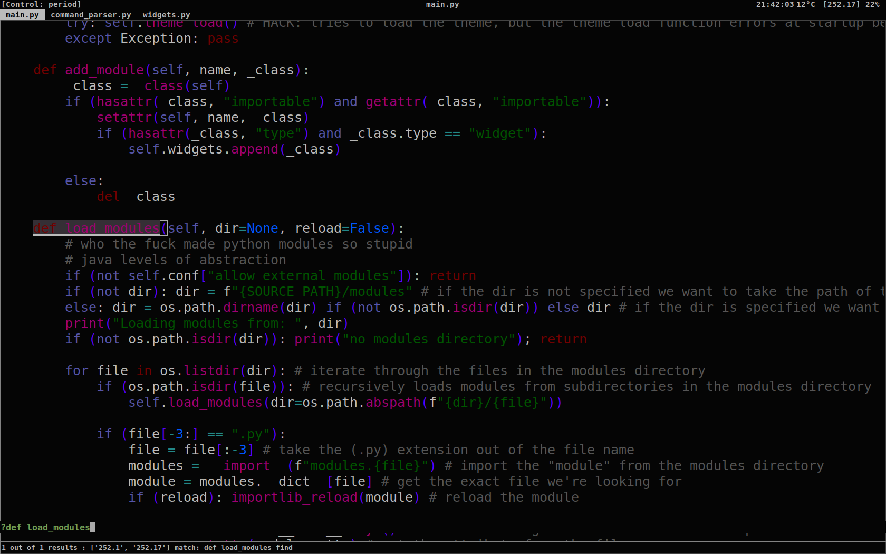
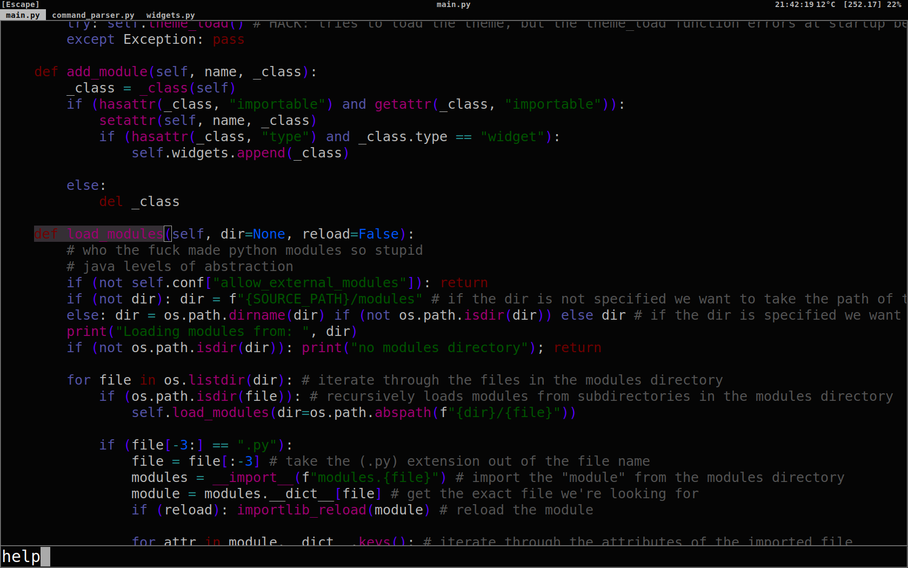
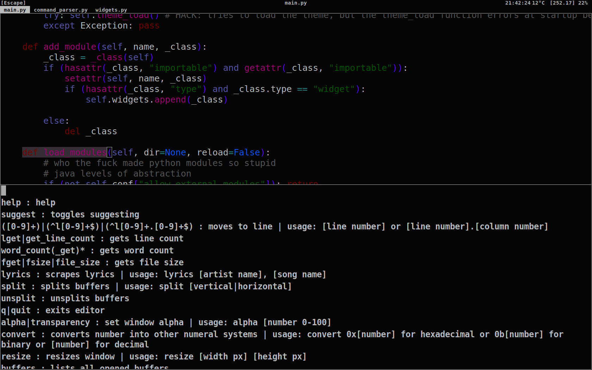
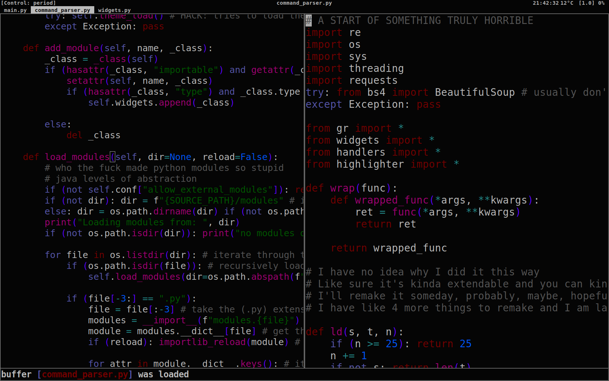
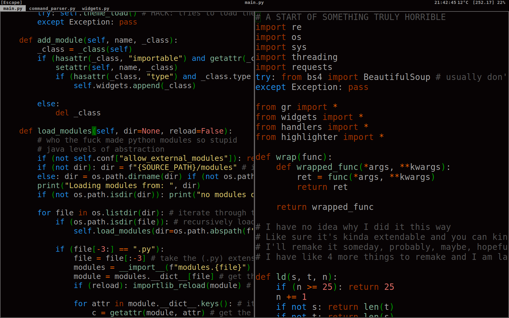
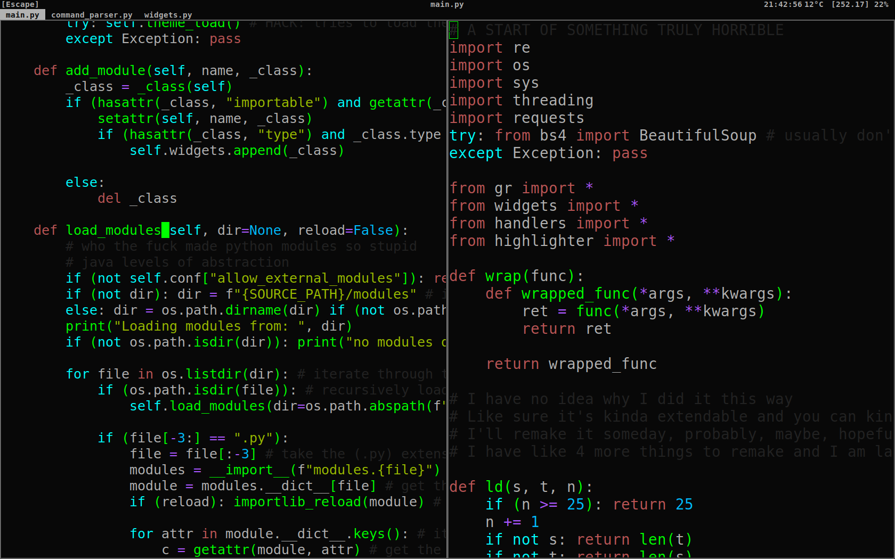
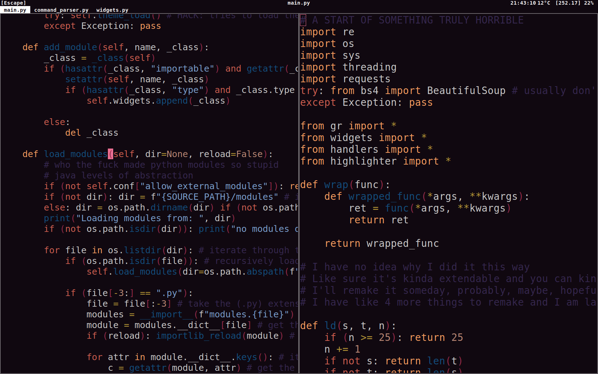
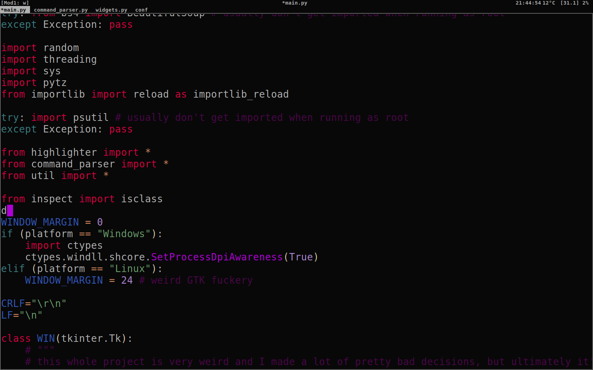
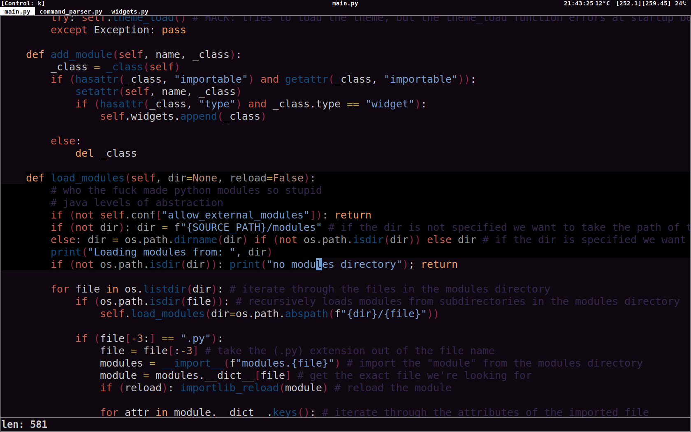
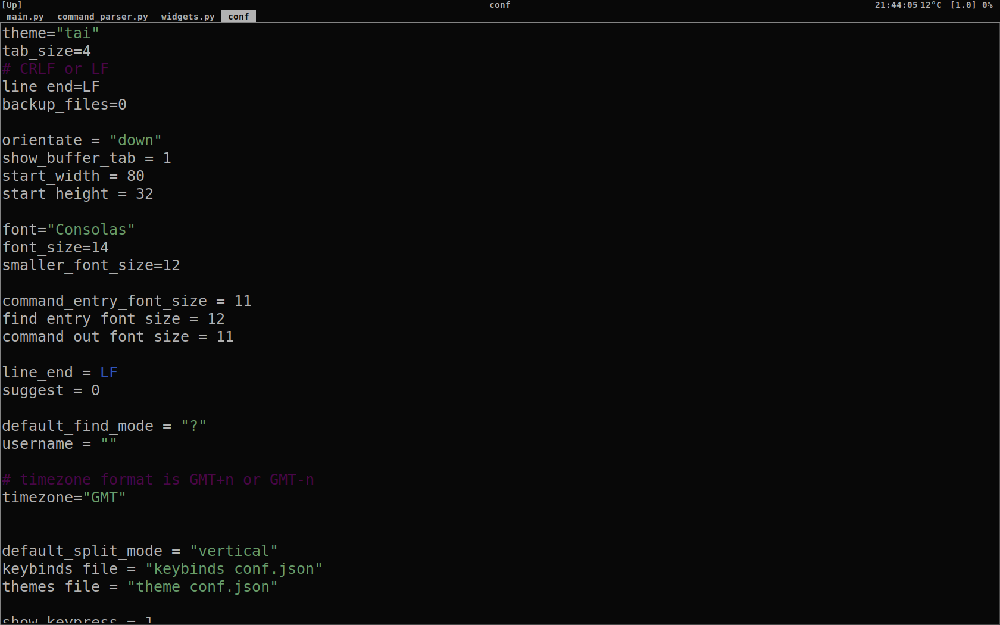
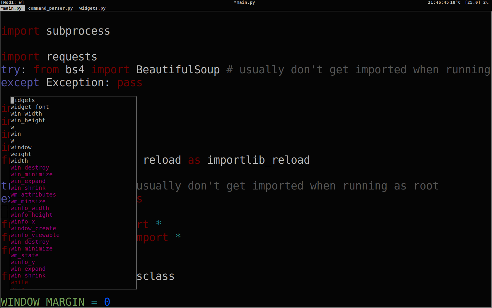
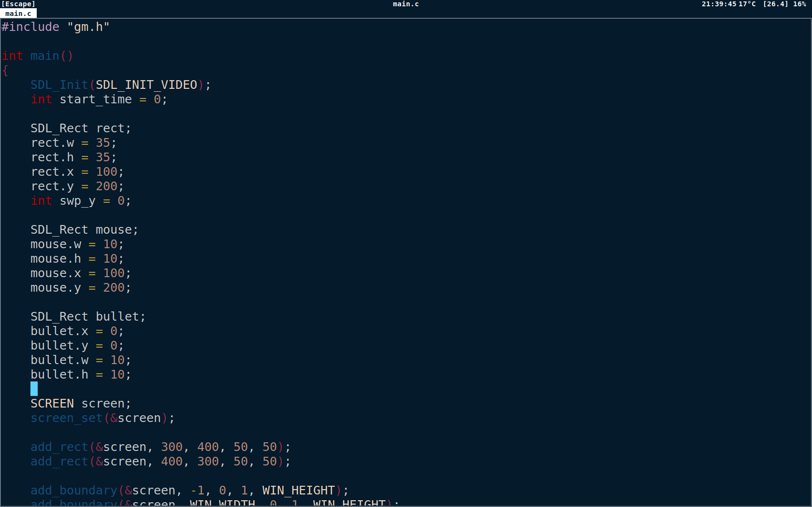
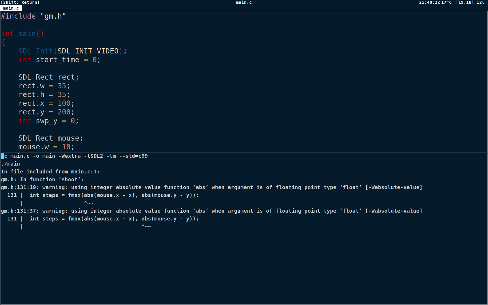